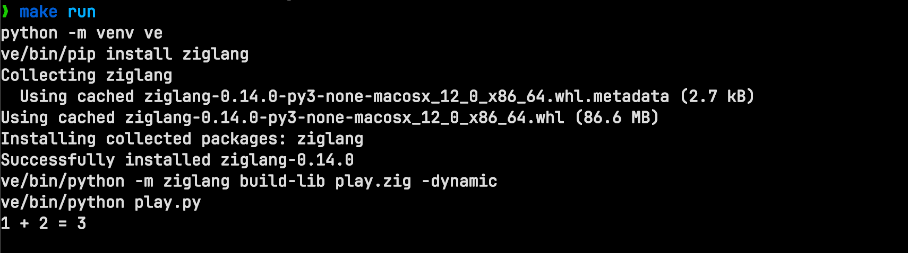

To build and run this project, all you need is a recent Python and Make (which is
probaly included with your OS).

Zig is installed via the [ziglang package](https://pypi.org/project/ziglang/) so there's
nothing you need to do there.

Check out this repo and run `make run`.

The dependencies will be installed, the `play.zig` extention will be built and the
Python program that calls it will be run.
